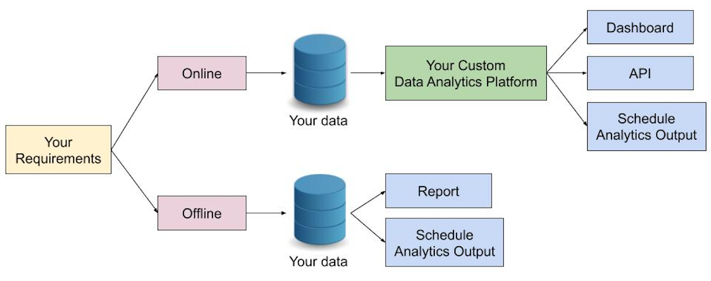

# Showcase of Data Analytics in E-commerce

## Dataset Background
We chose a [Brazilian ecommerce public dataset of orders](https://www.kaggle.com/olistbr/brazilian-ecommerce) made at [Olist Store](https://olist.com/) as our sample dataset to showcase applications of Data Analytics in E-commerce. The dataset is real commercial data that has been anonymised. It contains information of 100K orders from 2016 to 2018 made at marketplace in Brazil. It also features corresponding meta-data to an order including product attributes, customer attributes, seller attributes, payments, and reviews. The data schema of this dataset is as follows:

## Wrap-up Diagram

## What can we offer?
* Offline Analytics
  * Basic EDA Analysis
  * Machine Learning (optional)
  * Seller Analysis
    * Single Seller View
    * Seller Segmentation
  * Customer Analysis
    * Returning Customer and Customer Retention Analysis
  * Geo Analysis
  * Review Analysis
* Online Analytics

---

 

* **Special-Force-AI** can help you discovering a proper solution to directly solve the issue or pain-point of your company rapidly
* **Special-Force-AI** is capable of analysing many data types (unstructure to structure) and from individual to company perspectives
* **Special-Force-AI** not only focus on applying advance analytic tools and techniques, but also able to deliver an optimised meaningful outcome based on your specific requirements
* **Special-Force-AI** expertise covers Data Structure, Data Mining and Processing, EDA, Machine Learning, NLP, and Data Visualization
