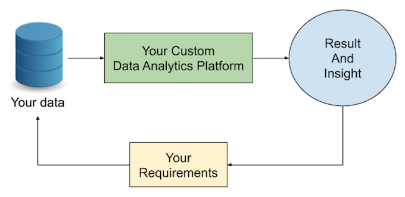

# Showcase of Custom Data Analytics Platform

## Data Analytics Platform

## Wrap-up Diagram

## What can we offer?
* **DigitAIs** can help you discovering a proper solution to directly solve the issue or pain-point of your company rapidly
* **DigitAIs** is capable of analysing many data types (unstructure to structure) and from individual to company perspectives
* **DigitAIs** not only focus on applying advance analytic tools and techniques, but also able to deliver an optimised meaningful outcome based on your specific requirements
* **DigitAIs** expertise covers Data Structure, Data Mining and Processing, EDA, Machine Learning, NLP, and Data Visualization

## Use Cases
* E-commerce: The dataset is real commercial data that has been anonymised. It contains information of 100K orders from 2016 to 2018 made at marketplace in Brazil. It also features corresponding meta-data to an order including product attributes, customer attributes, seller attributes, payments, and reviews.

---
 
* Offline Analytics
  * Basic EDA Analysis
  * Machine Learning (optional)
  * Seller Analysis
    * Single Seller View
    * Seller Segmentation
  * Customer Analysis
    * Returning Customer and Customer Retention Analysis
  * Time-Series Analysis
  * Geo Analysis
  * Review Analysis
* Online Analytics
  * Google Cloud Platform (GCP)
  * Application Programming Interface (API)
