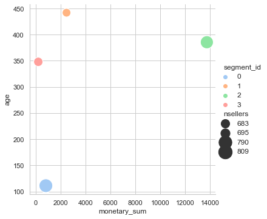

## Our Analyses

---

# Showcase applications of Data Analytics in E-commerce

## Dataset Background
We chose a [Brazilian ecommerce public dataset of orders](https://www.kaggle.com/olistbr/brazilian-ecommerce) made at [Olist Store](https://olist.com/) as our sample dataset to showcase applications of Data Analytics in E-commerce. The dataset is real commercial data that has been anonymised. It contains information of 100K orders from 2016 to 2018 made at marketplace in Brazil. It also features corresponding meta-data to an order including product attributes, customer attributes, seller attributes, payments, and reviews. The data schema of this dataset is as follows:

## 1. Customer Analytics
Here we demonstrated applications of Data Ananlytics on an aspect of customers in E-commerce data. The first one is extracting of a Single Customer View from multi-dimensional data. The second one is a Customer Segmentation using a Machine Learning Model.

### 1.1 Single Customer View
A single customer view is multi-dimensional data of customers boiled down to a single record for ease of sorting or filtering in different aspects. Multiple features which reflect behaviour and value of customers are extracted so these could be further used to customise user experience or make informed marketing decisions.
  
The following table is a sample of a customer single view extracted from the sample dataset.
 
Here are the explanation of each feature:
- `recency` : When was the last time that a customer active?
- `total_order` : How many orders does a seller receive in total?
- `age` : How long has a customer been on the platform since its first sale made?
- `frequency` : How frequently orders are made in a given unit of time (our unit here is orders per month)?
- `days_btw_order` : How long does a seller have to wait on average to receive the next order?
- `monetary_avg` : What is the average order value?
- `monetary_sum` : What is the gross revenue of a seller so far?
- `quantity_avg` : What is the average number of products within order?
- `total_categories` : How many product categories does a seller have?
- `category_with_most_sales` : What is the best seller category of a seller?

|    | seller_id                        |   recency |   total_order |   age |       frequency |   days_btw_order |   monetary_avg |   monetary_sum |   quantity_avg |   total_categories | category_with_most_sales   |
|:---:|:---------------------------------:|:---------------------:|:--------------:|:------:|:-----------:|:-----------------:|:---------------:|:---------------:|:---------------:|:--------:|:--------------------------------:|
|  0 | 0015a82c2db000af6aaaf3ae2ecb0532 |                  321 |             3 |   343 | 0.00874636 |        114.333   |       895      |         2685   |        1       |       1 | small_appliances                |
|  1 | 001cca7ae9ae17fb1caed9dfb1094831 |                   54 |           200 |   577 | 0.34662    |          2.885   |       125.4    |        25080   |        1.195   |       2 | garden_tools                    |
|  2 | 002100f778ceb8431b7a1020ff7ab48f |                  145 |            51 |   355 | 0.143662   |          6.96078 |        24.2059 |         1234.5 |        1.07843 |       1 | furniture_decor                 |
|  3 | 003554e2dce176b5555353e4f3555ac8 |                  263 |             1 |   263 | 0.00380228 |        263       |       120      |          120   |        1       |       1 | na                              |
|  4 | 004c9cd9d87a3c30c522c48c4fc07416 |                  124 |           158 |   585 | 0.270085   |          3.70253 |       124.764  |        19712.7 |        1.07595 |       2 | bed_bath_table                  |

 
Each of the feature could be further summarised for an overview look of customers in different prospectives.
 

**Recency**
 

 

|       |   recency |
|:------:|:---------------------:|
| count |             2977     |
| mean  |              136.035 |
| std   |              163.83  |
| min   |                1     |
| 25%   |               19     |
| 50%   |               48     |
| 75%   |              212     |
| max   |              701     |

 

**Total orders**
 

 

|       |   total_order |
|:------:|:--------------:|
| count |     2977      |
| mean  |       33.2304 |
| std   |      106.595  |
| min   |        1      |
| 25%   |        2      |
| 50%   |        7      |
| 75%   |       22      |
| max   |     1844      |

 

**Days between orders**
 

 

|       |   days_btw_order |
|:------:|:-----------------:|
| count |      2977        |
| mean  |        79.5608   |
| std   |       127.415    |
| min   |         0.305857 |
| 25%   |        10.6429   |
| 50%   |        27.6      |
| 75%   |        83        |
| max   |       701        |

 

**Average monetary**
 

 

|       |   monetary_avg |
|:------:|:---------------:|
| count |       2977     |
| mean  |        195.698 |
| std   |        368.065 |
| min   |          6     |
| 25%   |         60.15  |
| 50%   |        105.337 |
| 75%   |        188.61  |
| max   |       6735     |

 

**Total monetary**
 

 

|       |   monetary_sum |
|:------:|:---------------:|
| count |        2977    |
| mean  |        4491.85 |
| std   |       14070.8  |
| min   |           6.5  |
| 25%   |         219.8  |
| 50%   |         848.3  |
| 75%   |        3522    |
| max   |      229238    |

 

**Average quantity**
 

 

|       |   quantity_avg |
|:------:|:---------------:|
| count |    2977        |
| mean  |       1.15571  |
| std   |       0.442877 |
| min   |       1        |
| 25%   |       1        |
| 50%   |       1        |
| 75%   |       1.14286  |
| max   |      15        |

 

### 1.2 Customer Segmentation
A customer segmentation could be automatically computed using a Unsupervised Machine Learning Model based on the Single Customer View. Segments of similar customers are extracted so that customised actions and plans could be crafted for each segment to maximise the business outcome.
  
Here are a sample customer segmentation performed on the dataset. Four segments of customer were derived. Each of them are different in serveral aspects and posesses different business values. For example, a marketing campaign to attract more traffic to the platform would probably focus on sellers in the `Highest value` segment. On the other hand, a marketing campaign for promoting growth of potential sellers would probably focus on sellers in the `Rising star` segment.

**Segment profiles**
- `0` : Rising star - These are new sellers who are gaining tractions on orders and have potential to be valuable sellers.
- `1` : X potential customer - These are potential sellers who has been on the platform for a long time but are recently less active.
- `2` : Highest value sellers - These are sellers with higest values.
- `3` : Inactive - These are inactive sellers.

## 2. Geo-Location Analytics
Geo-location dataset (with coordinates) can be used to understand and discover the data from another perspective, in this case, using the location of the customers. This section use dataset purely from the geo0location to plot the distribution of zip codes across the country, states, and cities level.

Analysis of geo-location by zip codes from country to city level throughout Brazil.




 

### 2.1 Other analyses by zip codes
Geo-location dataset can be merged with other types of datasets, such as **Customer Information**, **Seller**, and **Order**; to produce analysis with greater insight. Not only we know where they are, but also what happen within that region. For example, using the geo-location we can discover the revenue of the order, calculate aggregated freight value, explore average delivery time, and so on in zip code level.

 





 

### 2.2 Which region has the most order?

City | Number of orders
--- | --- 
Sao paulo | 17808
Rio de janeiro | 7837
Belo horizonte | 3144

 





