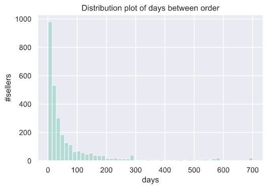
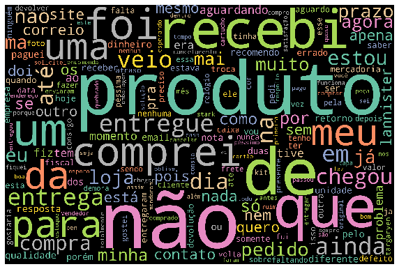
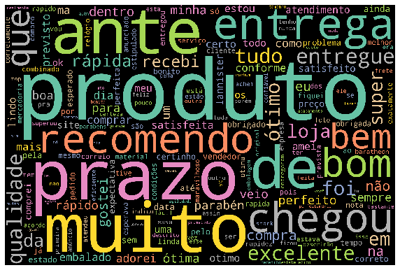

This is Analyses page where additional contents or analyses is being placed and referred.

## Dataset Background
We chose a [Brazilian ecommerce public dataset of orders](https://www.kaggle.com/olistbr/brazilian-ecommerce) made at [Olist Store](https://olist.com/) as our sample dataset to showcase applications of Data Analytics in E-commerce. The dataset is real commercial data that has been anonymised. It contains information of 100K orders from 2016 to 2018 made at marketplace in Brazil. It also features corresponding meta-data to an order including product attributes, customer attributes, seller attributes, payments, and reviews. The data schema of this dataset is as follows:

Datasets information
* `olist_orders_dataset` : This is the core dataset. From each order you might find all other information.
* `olist_order_customer_dataset` : This dataset has information about the customer and their location.
* `olist_order_items_dataset` : This dataset includes data about the items purchased within each order.
* `olist_order_payments_dataset` : This dataset includes data about the orders payment options.
* `olist_order_reviews_dataset` : This dataset includes data about the reviews made by the customers.
* `olist_products_dataset` : This dataset includes data about the products sold by the company. (e.g. weight, height, width)
* `olist_sellers_dataset` : This dataset includes data about the sellers that fulfilled orders made at the company and its location and to identify which seller fulfilled each product.
* `olist_geolocation_dataset` : This dataset has information Brazilian zip codes and its lat/lng coordinates.

## 1. Seller Analytics
Here we demonstrated applications of Data Ananlytics on the aspect of sellers on E-commerce data. The first one is extracting of a Single Customer View from multi-dimensional data. The second one is a Seller Segmentation using a Machine Learning Model.
 
Following datas were used for this Seller Analytics analysis: 
1. `olist_orders_dataset`
2. `olist_order_items_dataset`
3. `olist_products_dataset`

### 1.1 Single Customer View
A single customer view is multi-dimensional data of sellers boiled down to a single record for ease of sorting or filtering in different aspects. Multiple features which reflect behaviour and value of different sellers are extracted so these could be further used to customise user experience or make informed marketing decisions.
  
The following table is a sample of a single customer view extracted from the sample dataset.
 
Here are the explanation of each feature:
- `recency` : When was the last time that a customer active?
- `total_order` : How many orders does a seller receive in total?
- `age` : How long has a customer been on the platform since its first sale made?
- `frequency` : How frequently orders are made in a given unit of time (our unit here is orders per month)?
- `days_btw_order` : How long does a seller have to wait on average to receive the next order?
- `monetary_avg` : What is the average order value?
- `monetary_sum` : What is the gross revenue of a seller so far?
- `quantity_avg` : What is the average number of products within order?
- `total_categories` : How many product categories does a seller have?
- `category_with_most_sales` : What is the best seller category of a seller?

| seller_id                        |   recency |   total_order |   age |       frequency |   days_btw_order |   monetary_avg |   monetary_sum |   quantity_avg |   total_categories | category_with_most_sales   |
|:---------------------------------:|:---------------------:|:--------------:|:------:|:-----------:|:-----------------:|:---------------:|:---------------:|:---------------:|:--------:|:--------------------------------:|
| 0015a82c2db000af6aaaf3ae2ecb0532 |                  321 |             3 |   343 | 0.00874636 |        114.333   |       895      |         2685   |        1       |       1 | small_appliances                |
| 001cca7ae9ae17fb1caed9dfb1094831 |                   54 |           200 |   577 | 0.34662    |          2.885   |       125.4    |        25080   |        1.195   |       2 | garden_tools                    |
| 002100f778ceb8431b7a1020ff7ab48f |                  145 |            51 |   355 | 0.143662   |          6.96078 |        24.2059 |         1234.5 |        1.07843 |       1 | furniture_decor                 |
| 003554e2dce176b5555353e4f3555ac8 |                  263 |             1 |   263 | 0.00380228 |        263       |       120      |          120   |        1       |       1 | na                              |
| 004c9cd9d87a3c30c522c48c4fc07416 |                  124 |           158 |   585 | 0.270085   |          3.70253 |       124.764  |        19712.7 |        1.07595 |       2 | bed_bath_table                  |

 
Each of the feature could be further summarised for an overview look of sellers in different prospectives.
 

**Recency**
 

 

|       |   recency |
|:------:|:---------------------:|
| count |             2977     |
| mean  |              136.035 |
| std   |              163.83  |
| min   |                1     |
| 25%   |               19     |
| 50%   |               48     |
| 75%   |              212     |
| max   |              701     |

 

**Total orders**
 

 

|       |   total_order |
|:------:|:--------------:|
| count |     2977      |
| mean  |       33.2304 |
| std   |      106.595  |
| min   |        1      |
| 25%   |        2      |
| 50%   |        7      |
| 75%   |       22      |
| max   |     1844      |

 

**Days between orders**
 

 

|       |   days_btw_order |
|:------:|:-----------------:|
| count |      2977        |
| mean  |        79.5608   |
| std   |       127.415    |
| min   |         0.305857 |
| 25%   |        10.6429   |
| 50%   |        27.6      |
| 75%   |        83        |
| max   |       701        |

 

**Average monetary**
 

 

|       |   monetary_avg |
|:------:|:---------------:|
| count |       2977     |
| mean  |        195.698 |
| std   |        368.065 |
| min   |          6     |
| 25%   |         60.15  |
| 50%   |        105.337 |
| 75%   |        188.61  |
| max   |       6735     |

 

**Total monetary**
 

 

|       |   monetary_sum |
|:------:|:---------------:|
| count |        2977    |
| mean  |        4491.85 |
| std   |       14070.8  |
| min   |           6.5  |
| 25%   |         219.8  |
| 50%   |         848.3  |
| 75%   |        3522    |
| max   |      229238    |

 

**Average quantity**
 

 

|       |   quantity_avg |
|:------:|:---------------:|
| count |    2977        |
| mean  |       1.15571  |
| std   |       0.442877 |
| min   |       1        |
| 25%   |       1        |
| 50%   |       1        |
| 75%   |       1.14286  |
| max   |      15        |

 

### 1.2 Seller Segmentation
A seller segmentation could be automatically computed using a Unsupervised Machine Learning Model based on the Single Customer View. Segments of similar sellers are extracted so that customised actions and plans could be crafted for each segment to maximise the business outcome.
  
Here are a sample seller segmentation performed on the dataset. Four segments of seller were derived. Each of them are different in serveral aspects and posesses different business values. For example, a marketing campaign to attract more traffic to the platform would probably focus on sellers in the segment with highest monetary value. On the other hand, a marketing campaign for promoting growth of potential sellers would probably focus on sellers in the segment of new sellers who already made some impressive sales.

**Segment profiles**
- `0` : Rising star - These are new sellers who are gaining tractions on orders and have potential to be valuable sellers.
- `1` : Good old day - These were sellers who has been on the platform for a long time but are recently less active.
- `2` : Champion - These are the sellers with higest values.
- `3` : Inactive - These are inactive sellers.

Here is a table for summarising differnt features of each seller segment.

| Segment id | Segment name | #Sellers | Total monetary | Total order | Average monetary per order | Recency | Averge days between orders | Age on platform |
|:---:|:---:|:---:|:---:|:---:|:---:|:---:|:---:|:---:|
| 0 | Rising star | ~800 | Low | Low (< 10 orders) | Small value | Recent (< 50 days) | Short (< 30 days) | Youngest (~100 days) |
| 1 | Good old day | ~700 | Medium | Medium (> 10 orders) | Largest value | Long ago (~ 200 days) | Long (~75 days) | Oldest (~450 days) |
| 2 | Champion | ~800 | High | Highest (> 100 orders) | Small value | Recent (< 50 days) | Shortest (< 10 days) | Old (~400 days) |
| 3 | Inactive | ~700 | Low | Lowest (<< 10 order) | Small value | Long ago (~ 300 days) | Longest (> 200 days) | Old (~350 days) |

To visualize different features of each seller segment, bubble plots between an average value of Total monetary and other features were presented below where a bubble size represents a size of population.

## 2. Returning Customers Analytics
Another important aspect of customers analytics is to understand and differentiate between one-time customers and returning customers. Questions like How many customers are one-time or returning type?, Does the returning customers tend to spend more?, What makes returning customers return to the platform?, or How does the retention change over time on a platform? are all important questions to ask to gain insight on How could a platform retain more of its customers?

### 2.1 Overview look of one-time vs returning customers
Only 3% of 96K unique customers is returning on the platform.

The two groups are not different on the aspect of spending. The median of purchased product prices are X and Y for one-time and returning customers, respectively.

### 2.2 What makes customers return to the platform?
It worths discovering which product categories are preferred by returning customers compared to one-time customers. Here, it was observed that returning customers tend to buy more of the following product categories: `bed_bath_table`, `fashion_bags_accesories`, `furniture_decors`, `home_appliances`, and `sports_lerisure`

Even though there is no difference in payment method preference of the two groups, returning customers tend to pay with slightly longer installment.

### 2.3 Customers Retention Over Time
Next, we'll be looking at how customers in each cohort group retain on the platform. It became clear that all of the cohort groups have retention rate no more than 1% and it was more likely to retain 1% of customer during the next month of first puchase month.

## 3. Geo-Location Analytics
`olist_geolocation_dataset` can be used to discover and understand the data from the location perspective, in this case, using the location of the customers. This section use dataset purely from the geo-location to plot the distribution of zip codes across the country, states, and cities level.

Analysis of geo-location by zip codes from country to city level throughout Brazil.




 

### 3.1 Other analyses by zip codes
Geo-location dataset can be merged with other types of datasets, such as `olist_order_customer_dataset`, `olist_orders_dataset`, and `olist_order_items_dataset`; to produce analysis with greater insight. Not only we know where they are, but also what happen within that region. For example, using the geo-location we can 1) discover the revenue of the order, 2) calculate aggregated freight value per area, 3) explore average delivery time, and so on in zip code level.

 





 

### 3.2 Which region has the most order?

City | Number of orders
--- | --- 
Sao paulo | 17808
Rio de janeiro | 7837
Belo horizonte | 3144

 





 

### 3.3 What product should be recommend in different region? (normalised to the number of customer)
By including `olist_products_dataset` dataset in the existing geo-location analytics, we can explore what product is more preferred in regional level.
It is clear that although big cities like Sao Paolo and Rio have more order than the other regions, preference of product for customer (in states level) can be varied and may not conform the high-demand.



## 4. Review Analysis
We could also extract insightful information from text data using the customer reviews data from `olist_order_reviews_dataset`. In the following table, reviews interm of rating and comment corresponding to orders are given.
 
First, we analyzed the overall proportion of the review rating. Here, we selected 41,753 reviews with non-empty review comments out of 100,000 all reviews for the analysis. We observed that around half of the reviews got the excellent rating score of 5. On the other hand, the bad rating score of less than or equal to 2 accounts for around 25% of all reviews.

 
Next, we analyzed the tone of language used for different review rating scores. We used word cloud as our tool of analysis here where frequently appearing words are represented by larger fonts in the cloud.
By visualizing the tone of language in customer review comments could lead to insight about what customers like or do not like about particular services or products.
 
Word cloud of review rating of 1.

Word cloud of review rating of 2.

Word cloud of review rating of 3.

Word cloud of review rating of 4.

Word cloud of review rating of 5.

