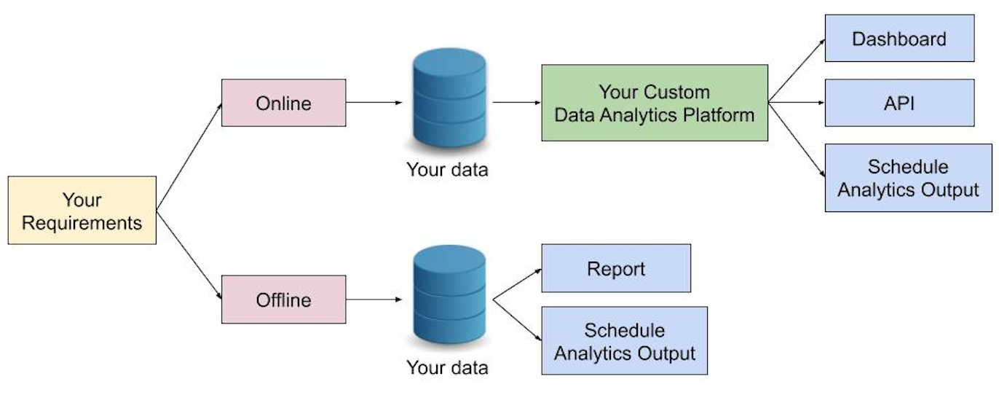

DigitAIs offers two stages of services, in which we are open to the client's preference to receive either a single stage or both stages. This is dependent on the specific requirements:
* Stage I: Digital Transformation & Data Platform Development
* Stage II: Data Analytics Platform Development

## Stage I

### Digital Transformation Process

### Data Platform Development

A Data Platform is a centralised system that allow data storage and management both internally and externally for a company. It is a basic infrastructure that any companies considering a digital transformation should have in place. Some benefits of a data platform are as follows:
- Time & Cost Efficiency: Data transfering amongs deparments on a data platform means reduction of time in manually sending and receiving files or documents.
- Data Consistency: A centralised data storage helps preventing inconsistencies of data as data is no longer distributed across different files.
- Transparency: Shifting data operation on a data platform allows every operations on a platform to be logged and monitored by a platform owner.
- Data Analytic: As your data platform is ready, your data would be further analysed for optimising your business or making any informed decisions.

To develop your custom data platform, we first need to gather and transform all your required datas in an agreed and stadardised data format. Then, the transformed data would be ingested into a Database or a File Storage System. To manage the data internally, a Data Management Application to perform basic operations (create/read/update/delete) on a Database or a File Storage System would be developped. In case when you need some of your data to be publicised, a public API could be developped to control data access from client applications i.e. web applications, mobile applications, or messengers.

Here is our demo of a simple data platform with the following [Data Mangement Application](https://product-fastapi-demo.herokuapp.com/product_view) and [Client Application](https://fir-api-client-web.firebaseapp.com/).

## Stage II

### Data Analytics Platform Development

* Offline Analytics
  * Basic EDA Analysis
  * Machine Learning (optional)
  * Seller Analysis
    * Single Seller View
    * Seller Segmentation
  * Customer Analysis
    * Returning Customer and Customer Retention Analysis
  * Time-Series Analysis
  * Geo Analysis
  * Review Analysis
* Online Analytics
  * Google Cloud Platform (GCP)
  * Application Programming Interface (API)

---

### Use Cases
* E-commerce: The dataset is real commercial data that has been anonymised. It contains information of 100K orders from 2016 to 2018 made at marketplace in Brazil. It also features corresponding meta-data to an order including product attributes, customer attributes, seller attributes, payments, and reviews.
* Banking: TBA
